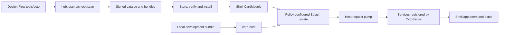

# App Hub code walkthrough

App Hub takes an app from a manifest and bundle to a verified installation
and a contained UI. This walkthrough follows that path, then shows where
OctoSense adds app agents and host services. Use this workspace's
[`Cargo.toml`](../Cargo.toml) and [`Cargo.lock`](../Cargo.lock), and the
[consumer's Cargo manifest](https://github.com/OctoSense-org/OctoSense/blob/main/Cargo.toml),
to identify the source versions used by your build.

For a first run, identify your app form below, then use
[§2](#2-run-the-right-host). Follow its bundle through admission, mounting
and a service reply in §§3–5. [§6](#6-what-declaring-an-app-agent-actually-enables)
adds a conversation to that app; the crate inventory is in
[§7](#7-source-reference).

## 1. What runs where

An **app** provides a user interface and data. An **agent** is a model-driven
conversation that can request tools; a tool is a named operation with JSON
arguments and a host implementation. A **peer** is the octos kernel's
identity and routing boundary for an agent. These are logical roles; §5
covers the threads and queues that carry their work.

App Hub supplies package admission, distribution and hosting. OctoSense
supplies the desktop/phone shells, app-agent peers and the octos runtime.
The shell starts model work after preparing an allowed app peer. The Python
`tools/octo` in Design Flow is a development command;
**octos** is the separate Rust agent kernel.

| App form | What executes | Where to start |
| --- | --- | --- |
| Native Rust app | A compiled `AppModule` creates widgets and a `ServiceExecutor` | [`app-host/src/lib.rs`](../crates/app-host/src/lib.rs); native modules live in OctoSense |
| Contained script app | `main.splash` is evaluated by Makepad's Script VM inside a Splash widget | [`entry.rs`](../crates/app-contract/src/entry.rs), [`card-host/src/host.rs`](../crates/card-host/src/host.rs) |
| L0 card app | `page.card` plus data and a kit is parsed/realized/lowered to Makepad UI | `card_source` and `lower` in [`host.rs`](../crates/card-host/src/host.rs) |

Splash is the Makepad Script containment/UI path. L0 uses the
Octoscript parser and `octoscript-makepad` lowering, then reaches Makepad.
A native Rust module can also embed Splash UI; its Rust implementation is
still compiled into its host.

An **isolate** is the app's separate script execution environment. Its storage
**jail** is the directory tree available to its sandboxed file operations.



The last two boxes are supplied by the shell. Standalone `card-host` has a
pump but registers no host services.

<a id="7-run-the-right-host"></a>

## 2. Run the right host

First prepare sibling sources using Design Flow's
[native workspace instructions](https://github.com/OctoSense-org/OctoScript-App-Design-Flow/blob/main/docs/NATIVE-WORKSPACE.md).
This workspace's [`Cargo.toml`](../Cargo.toml) patches paths to `../makepad`,
`../octoscript-makepad` and `../octoscript`. Missing siblings can prevent even
Cargo metadata or a policy-only test from resolving. A consumer's top-level
patches determine its actual versions; do not mix arbitrary latest engines
with a different consumer's runtime lock.

From App Hub. **Validation status: build, GUI and device execution unverified.**

```sh
cargo build --release -p octosense-card-host -p octosense-app-hub
cargo run -p octosense-app-hub --bin hub -- help
cargo test -p octosense-app-contract -p octosense-app-policy -p octosense-app-hub
cargo test -p octosense-card-host --test cli
```

Run a disposable unsigned development bundle:

```sh
MAKEPAD_HIDE_WINDOWS=1 MAKEPAD_REMOTE=8141 cargo run --release \
  -p octosense-card-host -- --bundle /absolute/path/my-app/bundle \
  --app-data /absolute/path/my-app/.local-state --allow-unsigned --stamp
```

That command stays in the foreground. In another terminal:

```sh
curl -s http://127.0.0.1:8141/snap
curl -s http://127.0.0.1:8141/quit
```

`--stamp` writes the manifest; use a development copy. This host uses
`RefuseAllSignatures`, so `--allow-unsigned` does not make a signed manifest
verifiable. Use the store path to test signatures. `--system` changes
admission limits for first-party bundles; it does not register Mail, models
or octos. Run shell integration to test those services.

For a native module, the standalone app binary registers `AppHostView` and
calls `open_in(module, open_json)`. In [`app-host`](../crates/app-host/src/lib.rs),
`create` validates arguments, allocates a Splash VM, supplies scoped
storage/viewport/reply handles and calls the Rust module. Event and draw
calls enter its VM. Its `ServiceExecutor` is retained but never called by
an assistant; upstream bus messages are drained. Running the same module
inside OctoSense adds the broker and agent integration.

To exercise distribution without publishing, use the documented
[fixture/preview commands](../crates/app-hub-app/README.md#exercise-installation-without-publishing-apps).
The fixture generates a local catalog and isolated environment settings;
only the full shell opens installed apps as clients. Native app, desktop,
Home APK and ROM build commands belong to the
[OctoSense README](https://github.com/OctoSense-org/OctoSense/blob/main/README.md).

## 3. From a manifest to a contained UI

Follow `policy_for` → `App::mount` in
[`card-host/src/host.rs`](../crates/card-host/src/host.rs):

1. Read `manifest.json`, compute the bundle digest, and optionally stamp
   the development copy. `admit_and_resolve_dir` checks the bytes and policy.
2. Use default limits for a store app or `HostLimits::system()` for a
   system app. The defaults in
   [`app-contract/src/policy.rs`](../crates/app-contract/src/policy.rs)
   include 16 MiB storage, 64 MiB heap and 20 million script instructions;
   system defaults include 64 MiB storage, 128 MiB heap and 4 billion
   instructions. Requests above ceilings are clamped.
3. `isolate_settings` in
   [`containers.rs`](../crates/app-policy/src/containers.rs) chooses
   `<app-data>/<manifest-id>` as the jail; the isolate gets it, and its
   quota, only when the manifest declares `storage`. An `AssetServer`
   serves bundle artwork on a loopback port; only its own port is added
   to the allowlist.
4. [`splash_adapter::apply`](../crates/app-policy/src/splash_adapter.rs)
   sets jail, quota, capabilities, prompt permission, host allowlist,
   instruction budget, heap limit and network access **before** evaluation.
5. `card_source` loads `main.splash`, or realizes `page.card` with
   `page.data.json` and `kit/`. Card lowering first tries measured design;
   ordinary L0 kit cards fall back to kit lowering. The output enters
   `Splash::set_text` and the Makepad event/draw loop.

A log saying `agent read-only` reports resolved metadata.
`AppPolicy::session_profile` serializes that policy; the shell builds the
actual peer and account storage.

## 4. From publication to launch

[`hub.rs`](../crates/app-hub/src/bin/hub.rs) dispatches the CLI commands;
[`hub-usage.txt`](../crates/app-hub/src/bin/hub-usage.txt) is their syntax.
`stamp` records a digest. `check` calls `check_bundle`: manifest admission,
bundle constraints, listing, references, secret-field checks and agent-file
review. UI behavior and screenshot quality are checked by running the app
and reviewing captures. `scan` prepares a review packet and optionally
invokes a publishing reviewer command
([`scan.rs`](../crates/app-hub/src/scan.rs)).

`publish` rechecks admission, copies the reviewed bundle and writes a signed
catalog. [`signing.rs`](../crates/app-hub/src/signing.rs) implements the
anchor/working-key trust chain. [`pack.rs`](../crates/app-hub/src/pack.rs)
encodes a bundle for transport. The catalog and artifacts are static files,
served by an HTTP origin or read from a local directory.

On the device, `Origin` in
[`appstore/src/source.rs`](../crates/appstore/src/source.rs) fetches a local
directory or HTTP origin. `Store::accept_catalog` verifies the signature
and rejects a sequence older than the catalog it already holds. Installation
checks freshness and bundle bytes before writing
`<app-data>/.bundles/<app-id>/bundle`, outside the app's own storage
(`<app-data>/<app-id>/`); an install from before that layout is moved there
once (`adopt_legacy_installs`). The 14-day freshness window applies to new installs.
Already-installed apps remain subject to `may_run`.

`CardAppView::start` reopens the last verified catalog and calls
`Store::may_run` for installed apps. A withdrawn version is refused on a
subsequent open using that catalog. An already-running instance keeps its
current lifecycle until the host closes it.
System apps instead come from
[`system::prepare`](../crates/appstore/src/system.rs), which unpacks a
compiled-in pack and applies system limits.

The shell-facing crate is
[`app-hub-app`](../crates/app-hub-app/README.md). Its
[`build.rs`](../crates/app-hub-app/build.rs) reads `OCTOSENSE_SYSTEM_APPS`
to pack the selected first-party bundles. Without that selection it ships
no system apps. `APP_HUB_MODULE` is the newer native store UI;
`CARD_MODULE` wraps the common Card runner. The standalone `appstore`
binary uses `APPSTORE_MODULE` from `appstore` through `AppHostView`;
launching installed app clients is the full shell's responsibility.

## 5. A host-service request, line by line

Consider a granted app calling
`host.request("mail.list", args, callback)`:

1. Makepad's Splash host API checks the capability and queues a request
   identified by `(heap_key, req_id)`. The heap key selects the originating
   isolate, and the request id selects its callback.
2. The runner calls `services::pump` on UI events. It avoids executing
   callbacks during drawing. It collects requests for this app and its
   visible host sheet only, parses arguments and builds `ServiceCall` with
   app identity, `from_sheet`, `may_prompt` and the host directory.
3. `dispatch` finds a registered `HostService` by the `mail` family.
   Missing service returns `no service answers "mail" on this device`.
   Requests to `mail.sheet.*` from an app are refused before dispatch.
4. The Rust service may finish now or move its `Replier` to a worker.
   `Replier::send` removes the pending request, queues a JSON reply and
   wakes the UI using `SignalToUI`.
5. A later `pump` delivers the result to the original isolate callback.
   A late or duplicate reply is ignored; closing an isolate calls
   `cancel_heap`, so it cannot answer a replacement app instance.

The default timeout is 60 seconds, with 32 pending requests per isolate and
256 globally. Arguments are bounded at 1 MiB and replies at 4 MiB. Services
may override the timeout. A host sheet suspends its request's deadline
while waiting for the person. The sheet owns its isolate and password input;
the app receives the service's result, not its credential.

These queues use `Mutex` and a native `std::thread` timeout sweeper. The
octos side uses async scheduling, explained in the
[OctoSense walkthrough](https://github.com/OctoSense-org/OctoSense/blob/61c668279a7c38a0f8056134d8d29e42ed715806/docs/architecture-walkthrough.md).

## 6. What declaring an app agent actually enables

### Follow a request for saved notes

The `mail.list` call in §5 is a UI-to-service request: it needs no model.
Now consider a different request, “Summarize my saved notes,” sent to an
app agent. Assume the app has stored those notes in its account workspace
and the person has allowed its agent in the OctoSense shell.

1. A person opens desktop `Ask <app>` and sends the request. The shell
   selects that app's peer—the agent identity—and its human conversation.
   An app-owned chat can instead enter through `octos.turn.start`, using
   the host-request transport from §5 to reach the shell's agent service.
2. The model can request the shell's bounded `files.list/read/search`
   tools on Unix. These read the exposed account folder; merely declaring
   `tools.json` does not make every UI record readable.
3. Tool results return to the model, which produces an answer for the
   originating human conversation. If the system assistant delegated the
   same question, it uses the app peer's separate system conversation and
   gathers that conversation's result instead.
4. A follow-up requiring another app's operation must pass that tool's
   admission, sharing and execution checks. For example, adding
   `mail.send` to `agent.tools` fails default admission; it is not a working
   cross-app recipe.

This example ties together three separate decisions: admission grants what
the app may request, the shell supplies tools that can actually execute,
and the active conversation determines where the answer returns.
Standalone `card-host` stops before this agent path because it has no
registered services or agent runtime.

### Declarations and executable tools

`AgentBundle::load` checks the digest again and validates the declaration.
`tools.json` describes tool names, schemas, risk, sharing, confirmation and
implementation ownership. A contained app's namespace is its id's last
segment; a native module uses its module id. `shareable: true` means a tool
can be granted to another caller; the caller still needs that grant.

`agent.tools` asks for tools from outside this manifest. Only
`ask_user_question` is an allowed plain kernel-tool name in contained app
policy. Dotted names must also be offered by the host. The default list is
in `HostLimits`; default admission rejects names outside that list,
including `mail.send`.

| Layer | Present in this source | What still requires shell support |
| --- | --- | --- |
| `agent`, model needs, background and triggers | Parsed and validated; budgets resolved | Selection by model needs and trigger/background scheduling are not implemented by these declarations |
| `AGENT.md` and `skills/` | Reviewed and loaded into `AgentBundle` | Current shell loader does not install their contents into app peers |
| `tools.json` | Names, schemas and policy checked | An executable handler; store app script tools have no dispatcher yet |
| Agent account data | Contract has `storage.accounts` and `agent_workspace` | Shell constructs the account workspace and its bounded read tools |
| Human/app conversation | No chat runtime in `card-host` | Shell consent, app peer and chat surfaces |

For the implementation boundary, read OctoSense's
[`script_apps.rs`](https://github.com/OctoSense-org/OctoSense/blob/main/crates/shell/src/host_tools/script_apps.rs).
It installs tool declarations and a `HostServiceExecutor`. Tools marked
`implemented_by: "host-service"` can reach a registered service when the
family is granted (or is a system app's own family). Script-implemented
tools return `app_tool_unavailable`; opening the app does not currently
supply the missing script dispatcher. The generic `CardExecutor` here also
returns unavailable. Existing system apps supply Rust service handlers;
a store bundle cannot add one simply by shipping JSON.

The system bundles demonstrate this split: News has read and notification
tools; Mail has `mail.notify`; Calendar has event and card tools. Photos,
Maps, Camera and YouTube declare their own `<namespace>.notify`, executed
by the shell's shared
[`glance_notice` service](https://github.com/OctoSense-org/OctoSense/blob/main/crates/shell/src/glance_notice.rs).
These declarations add an agent and a notice route, not general access to
camera controls or photo records. AI providers remains excluded from that
set: its `ai-providers` namespace fails the tool-name rule. The shell's
[`script_apps` tests](https://github.com/OctoSense-org/OctoSense/blob/main/crates/shell/src/host_tools/script_apps.rs)
record these exact tool rosters.

### Conversation routing and data access

The shell supplies the desktop `Ask <app>` panel, app-owned `octos.*` UI
and supported L0 card chat. See the
[shell chat surfaces](https://github.com/OctoSense-org/OctoSense/blob/61c668279a7c38a0f8056134d8d29e42ed715806/docs/architecture-walkthrough.md#6-where-a-person-talks-and-where-the-answer-goes)
for their entry points. The system agent
discovers permitted prepared peers and delegates using their actual peer
slug. A system request and a human request can reach the same app peer with
separate conversation lanes; the reply is routed back to its requester.
Each lane owns its transcript; sharing contexts receive bounded recent
history from the other lane, and the shell panel can display both.

The app agent's data workspace is normally its account folder,
`accounts/device/` for a single-account app. On Unix, the shell exposes bounded
`files.list/read/search` tools when the person has consented and that workspace
is available. App-owned records must be in the exposed workspace or
accessible through an implemented tool. A Rust host service's `.host`
state and secrets stay outside it. See
[`app_storage`](https://github.com/OctoSense-org/OctoSense/tree/main/crates/shell/src/app_storage)
and [`app-peers/storage.rs`](https://github.com/OctoSense-org/OctoSense/blob/main/crates/app-peers/src/storage.rs).

Cross-app tools require the owner's declaration, `shareable`, the caller's
grant and an executable owner route, plus approval where required.
Contained app agents cannot call `peer_send_input` or acquire system-agent
privileges through this tool route.

<a id="2-read-the-crates-in-this-order"></a>

## 7. Source reference

Use this index to revisit the path traced above. The first seven files
cover admission through reply delivery; the table covers other hosts and
authoring support.

1. [`app-contract/src/lib.rs`](../crates/app-contract/src/lib.rs): the
   shared, versioned data contract. `AppManifest` describes requests;
   `AppPolicy` describes grants. The shell uses these declarations when
   preparing an authorized octos session.
2. [`app-policy/src/policy.rs`](../crates/app-policy/src/policy.rs): resolve
   the app contract plus agent requests against `HostLimits`.
3. [`app-policy/src/agent.rs`](../crates/app-policy/src/agent.rs): validate
   `tools.json`, instructions and skills; construct an `AgentBundle`.
4. [`app-hub/src/gate.rs`](../crates/app-hub/src/gate.rs): produce the same
   admission report for local development and publication.
5. [`app-hub/src/client.rs`](../crates/app-hub/src/client.rs): the device's
   `Store`, catalog verification, installation and permission to run.
6. [`appstore/src/cardapp.rs`](../crates/appstore/src/cardapp.rs): mount a
   verified app in its own shell client.
7. [`appstore/src/services.rs`](../crates/appstore/src/services.rs): route
   script host requests and deliver replies.

The remaining crates and supporting directories complete the delivery path:

| Path | Role and next file |
| --- | --- |
| [`card-host`](../crates/card-host/src/main.rs) | Standalone contained bundle runner; argument parsing leads to `host::run` |
| [`app-host`](../crates/app-host/src/lib.rs) | One-window host for a compiled Rust `AppModule` |
| [`app-hub-app`](../crates/app-hub-app/README.md) | Shell integration: native store, Card runner, packed system apps and icons |
| [`appstore-app`](../crates/appstore-app/src/lib.rs) | Standalone `appstore` executable using `AppHostView` |
| [`card-studio`](../crates/card-studio/src/main.rs) | Hidden `card-host` captures at glance, phone and desktop sizes; measured checks and critique payload |
| [`skills/card-studio`](../skills/card-studio/SKILL.md) | octos skill exposing card rendering and critique preparation |
| [`templates/app`](../templates/app/README.md) | Card-app scaffold with bundle metadata and contributor instructions |

OctoSense consumes a git revision of App Hub selected by its `Cargo.toml`.
OctoSense, App Hub and Rinx request `octosense-app-contract = "1"` from
crates.io; the consumer lock records the resolved release. This workspace
alone patches that dependency to `crates/app-contract` for development.
Cargo applies patches from the top-level workspace, so that local patch
is not inherited by a shell consuming App Hub as a dependency.

## 8. Debug by boundary

| Symptom | First source/check |
| --- | --- |
| Cargo cannot find a manifest under a sibling path | Workspace patches and prepared runtime pins |
| Bundle refused | `hub check`; `gate.rs`, contract/policy resolution and digest |
| App admitted, blank UI | `card-host` log, `/snap`, script parse/lowering and asset paths |
| `no service answers` | `register_host_service` in the shell, not more bundle capabilities |
| Agent tool appears but fails | Owner/grant/executor route in shell `host_tools`; JSON is not implementation |
| Agent cannot see app records | Active account workspace and file placement, then storage read-tool limits |
| App peer absent | Shell consent and peer preparation; `card-host` has no peer list |

### Host offers for shipped agents

`appstore::system::set_agent_tool_offer(app_id, names)` lets a shell declare
additional tool names before `system::prepare` admits that shipped app. The
offer is scoped to its system id and checked on every prepare, including cached
bundles. The app must request a name in `agent.tools`; the shell relay still
checks the owning tool's sharing flag and the caller's grant before its executor
runs. Store-app admission and raw UI capabilities do not change.
