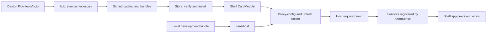

# App Hub code walkthrough for Rust beginners

This walkthrough follows App Hub `41bc959` and the sibling OctoSense source
on 2026-10-01. It explains the code, not a claim that every command below
has been run on every platform. Build, GUI and device commands below are
**unverified in this documentation review**. Follow the source links when
your checkout has a different revision.

## 1. What runs where

An **app** provides a user interface and data. An **agent** is a model-driven
conversation that can request tools; a tool is a named operation with JSON
arguments and a host implementation. A **peer** is the octos kernel's
identity and routing boundary for an agent. None of these words means an
operating-system process, Rust thread, or Tokio task.

App Hub supplies package admission, distribution and hosting. OctoSense
supplies the desktop/phone shells, app-agent peers and the octos runtime.
Installing a bundle or parsing an `agent` declaration here does not start a
model. The Python `tools/octo` in Design Flow is a development command;
**octos** is the separate Rust agent kernel.

| App form | What executes | Where to start |
| --- | --- | --- |
| Native Rust app | A compiled `AppModule` creates widgets and a `ServiceExecutor` | [`app-host/src/lib.rs`](../crates/app-host/src/lib.rs); native modules live in OctoSense |
| Contained script app | `main.splash` is evaluated by Makepad's Script VM inside a Splash widget | [`entry.rs`](../crates/app-contract/src/entry.rs), [`card-host/src/host.rs`](../crates/card-host/src/host.rs) |
| L0 card app | `page.card` plus data and a kit is parsed/realized/lowered to Makepad UI | `card_source` and `lower` in [`host.rs`](../crates/card-host/src/host.rs) |

The project name OctoScript does not make `.splash` and `.card` the same
language. Splash is the Makepad Script containment/UI path. L0 uses the
Octoscript parser and `octoscript-makepad` lowering, then reaches Makepad.
A native Rust module can also embed Splash UI; its Rust implementation is
still compiled into its host.



The last two boxes are supplied by the shell. Standalone `card-host` has a
pump but registers no host services.

## 2. Read the crates in this order

1. [`app-contract/src/lib.rs`](../crates/app-contract/src/lib.rs): the
   shared, versioned data contract. `AppManifest` describes requests;
   `AppPolicy` describes grants. This crate parses an agent block but does
   not create or authorize an octos session.
2. [`app-policy/src/policy.rs`](../crates/app-policy/src/policy.rs): resolve
   the app contract plus agent requests against `HostLimits`.
3. [`app-policy/src/agent.rs`](../crates/app-policy/src/agent.rs): validate
   `tools.json`, instructions and skills; construct an `AgentBundle`.
4. [`app-hub/src/gate.rs`](../crates/app-hub/src/gate.rs): produce the same
   admission report for local development and publication.
5. [`app-hub/src/client.rs`](../crates/app-hub/src/client.rs): the device's
   `Store`, catalog verification, installation and permission to run.
6. [`appstore/src/cardapp.rs`](../crates/appstore/src/cardapp.rs): mount a
   verified app in its own shell client.
7. [`appstore/src/services.rs`](../crates/appstore/src/services.rs): route
   script host requests and deliver replies.

For a junior Rust reader: `Result<T, String>` means success containing `T`
or an explanatory refusal; `?` propagates a refusal. `Option<T>` represents
absence, such as no agent. Traits such as `HostService` and `AppModule`
describe interfaces; `Box<dyn HostService>` stores implementations behind
one interface. `Mutex` protects shared data, but does not create a worker.

## 3. From a manifest to a contained UI

Follow `policy_for` → `App::mount` in
[`card-host/src/host.rs`](../crates/card-host/src/host.rs):

1. Read `manifest.json`, compute the bundle digest, and optionally stamp
   the development copy. `admit_and_resolve_dir` checks the bytes and policy.
2. Use default limits for a store app or `HostLimits::system()` for a
   system app. The defaults in
   [`app-contract/src/policy.rs`](../crates/app-contract/src/policy.rs)
   include 16 MiB storage, 64 MiB heap and 20 million script instructions;
   system defaults include 64 MiB storage, 128 MiB heap and 4 billion
   instructions. Requests above ceilings are clamped.
3. `isolate_settings` in
   [`containers.rs`](../crates/app-policy/src/containers.rs) chooses
   `<app-data>/<manifest-id>` as the jail. An `AssetServer` serves bundle
   artwork on a loopback port; only its own port is added to the allowlist.
4. [`splash_adapter::apply`](../crates/app-policy/src/splash_adapter.rs)
   sets jail, quota, capabilities, prompt permission, host allowlist,
   instruction budget, heap limit and network access **before** evaluation.
5. `card_source` loads `main.splash`, or realizes `page.card` with
   `page.data.json` and `kit/`. Card lowering first tries measured design;
   ordinary L0 kit cards fall back to kit lowering. The output enters
   `Splash::set_text` and the Makepad event/draw loop.

A log saying `agent read-only` reports resolved metadata. This mount path
does not construct an agent runtime. Likewise `AppPolicy::session_profile`
is a serializable helper, not the shell's complete peer/storage setup.

## 4. From publication to launch

[`hub.rs`](../crates/app-hub/src/bin/hub.rs) dispatches the CLI commands;
[`hub-usage.txt`](../crates/app-hub/src/bin/hub-usage.txt) is their syntax.
`stamp` records a digest. `check` calls `check_bundle`: manifest admission,
bundle constraints, listing, references, secret-field checks and agent-file
review. A passing gate does not prove UI behavior or screenshot quality.
`scan` prepares a review packet and optionally invokes a reviewer command
([`scan.rs`](../crates/app-hub/src/scan.rs)); it is not the device's app agent.

`publish` rechecks admission, copies the reviewed bundle and writes a signed
catalog. [`signing.rs`](../crates/app-hub/src/signing.rs) implements the
anchor/working-key trust chain. [`pack.rs`](../crates/app-hub/src/pack.rs)
encodes a bundle for transport. The catalog is distributed as files; a
separate central always-running octos service is not required by this code.

On the device, `Origin` in
[`appstore/src/source.rs`](../crates/appstore/src/source.rs) fetches a local
directory or HTTP origin. `Store::accept_catalog` verifies the signature
and rejects a sequence older than the catalog it already holds. Installation
checks freshness and bundle bytes before writing
`<app-data>/<app-id>/bundle`. The 14-day freshness window pauses new installs;
it does not by itself stop already-installed apps.

`CardAppView::start` reopens the last verified catalog and calls
`Store::may_run` for installed apps. A withdrawn version is refused on a
subsequent open using that catalog; this is not a live process-kill service.
System apps instead come from
[`system::prepare`](../crates/appstore/src/system.rs), which unpacks a
compiled-in pack and applies system limits.

The shell-facing crate is
[`app-hub-app`](../crates/app-hub-app/README.md). Its
[`build.rs`](../crates/app-hub-app/build.rs) reads `OCTOSENSE_SYSTEM_APPS`
to pack the selected first-party bundles. Without that selection it ships
no system apps. `APP_HUB_MODULE` is the newer native store UI;
`CARD_MODULE` wraps the common Card runner. The standalone `appstore`
binary uses `APPSTORE_MODULE` from `appstore` through `AppHostView`;
the store preview and standalone store are not full shells.

## 5. A host-service request, line by line

Consider a granted app calling
`host.request("mail.list", args, callback)`:

1. Makepad's Splash host API checks the capability and queues a request
   identified by `(heap_key, req_id)`. A heap identifies an isolate; it is
   not a peer slug.
2. The runner calls `services::pump` on UI events. It avoids executing
   callbacks during drawing. It collects requests for this app and its
   visible host sheet only, parses arguments and builds `ServiceCall` with
   app identity, `from_sheet`, `may_prompt` and the host directory.
3. `dispatch` finds a registered `HostService` by the `mail` family.
   Missing service returns `no service answers "mail" on this device`.
   Requests to `mail.sheet.*` from an app are refused before dispatch.
4. The Rust service may finish now or move its `Replier` to a worker.
   `Replier::send` removes the pending request, queues a JSON reply and
   wakes the UI using `SignalToUI`.
5. A later `pump` delivers the result to the original isolate callback.
   A late or duplicate reply is ignored; closing an isolate calls
   `cancel_heap`, so it cannot answer a replacement app instance.

The default timeout is 60 seconds, with 32 pending requests per isolate and
256 globally. Arguments are bounded at 1 MiB and replies at 4 MiB. Services
may override the timeout. A host sheet suspends its request's deadline
while waiting for the person. The sheet owns its isolate and password input;
the app receives the service's result, not its credential.

These queues use `Mutex` and a native `std::thread` timeout sweeper. App Hub
does not map each service call or widget to a Tokio task. The octos side has
its own async scheduling, explained in the
[OctoSense walkthrough](https://github.com/OctoSense-org/OctoSense/blob/main/docs/architecture-walkthrough.md).

## 6. What declaring an app agent actually enables

`AgentBundle::load` checks the digest again and validates the declaration.
`tools.json` describes tool names, schemas, risk, sharing, confirmation and
implementation ownership. A contained app's namespace is its id's last
segment; a native module uses its module id. `shareable: true` means a tool
can be granted to another caller, not that every agent gets it automatically.

`agent.tools` asks for tools from outside this manifest. Only
`ask_user_question` is an allowed plain kernel-tool name in contained app
policy. Dotted names must also be offered by the host. The default list is
in `HostLimits`; arbitrary `mail.send`, peer or shell privileges are not
granted just because the file names them. Host-level relay support is not
evidence that a default store manifest can pass admission with those names.

| Layer | Present in this source | What still requires shell support |
| --- | --- | --- |
| `agent`, model needs, background and triggers | Parsed and validated; budgets resolved | Selection by model needs and trigger/background scheduling are not implemented by these declarations |
| `AGENT.md` and `skills/` | Reviewed and loaded into `AgentBundle` | Current shell loader does not install their contents into app peers |
| `tools.json` | Names, schemas and policy checked | An executable handler; store app script tools have no dispatcher yet |
| Agent account data | Contract has `storage.accounts` and `agent_workspace` | Shell constructs the account workspace and its bounded read tools |
| Human/app conversation | No chat runtime in `card-host` | Shell consent, app peer and chat surfaces |

For the implementation boundary, read OctoSense's
[`script_apps.rs`](https://github.com/OctoSense-org/OctoSense/blob/main/crates/shell/src/host_tools/script_apps.rs).
It installs tool declarations and a `HostServiceExecutor`. Tools marked
`implemented_by: "host-service"` can reach a registered service when the
family is granted (or is a system app's own family). Script-implemented
tools return `app_tool_unavailable`; opening the app does not currently
supply the missing script dispatcher. The generic `CardExecutor` here also
returns unavailable. Existing system apps supply Rust service handlers;
a store bundle cannot add one simply by shipping JSON.

In the shell, the person can use the desktop **Ask &lt;app&gt;** panel,
an app's own `octos.*` UI, or supported L0 card chat. The phone's general
per-app panel entry is not implemented at this snapshot. The system agent
discovers permitted prepared peers and delegates using their actual peer
slug. A system request and a human request can reach the same app peer with
separate conversation lanes; the reply is routed back to its requester.
They do not automatically get a shared transcript.

The app agent's data workspace is normally its account folder,
`accounts/device/` for a single-account app. The shell exposes bounded read
tools; the agent is not handed an unrestricted database or every file in
the app's jail. App-owned records must be in the exposed workspace or
accessible through an implemented tool. A Rust host service's `.host`
state and secrets stay outside it. See
[`app_storage`](https://github.com/OctoSense-org/OctoSense/tree/main/crates/shell/src/app_storage)
and [`app-peers/storage.rs`](https://github.com/OctoSense-org/OctoSense/blob/main/crates/app-peers/src/storage.rs).

Cross-app tools require the owner's declaration, `shareable`, the caller's
grant and an executable owner route, plus approval where required. App
agents are not unrestricted system agents: do not assume they can invoke
`peer_send_input` or ask the system agent to bypass their permissions.

## 7. Run the right host

First prepare sibling sources using Design Flow's
[native workspace instructions](https://github.com/OctoSense-org/OctoScript-App-Design-Flow/blob/main/docs/NATIVE-WORKSPACE.md).
This workspace's [`Cargo.toml`](../Cargo.toml) patches paths to `../makepad`,
`../octoscript-makepad` and `../octoscript`. Missing siblings can prevent even
Cargo metadata or a policy-only test from resolving. A consumer's top-level
patches determine its actual versions; do not mix arbitrary latest engines
with a different consumer's runtime lock.

From App Hub (commands source-checked, not built/run in this review):

```sh
cargo build --release -p octosense-card-host -p octosense-app-hub
cargo run -p octosense-app-hub --bin hub -- help
cargo test -p octosense-app-contract -p octosense-app-policy -p octosense-app-hub
cargo test -p octosense-card-host --test cli
```

Run a disposable unsigned development bundle:

```sh
MAKEPAD_HIDE_WINDOWS=1 MAKEPAD_REMOTE=8141 cargo run --release \
  -p octosense-card-host -- --bundle /absolute/path/my-app/bundle \
  --app-data /absolute/path/my-app/.local-state --allow-unsigned --stamp
```

That command stays in the foreground. In another terminal:

```sh
curl -s http://127.0.0.1:8141/snap
curl -s http://127.0.0.1:8141/quit
```

`--stamp` writes the manifest; use a development copy. This host uses
`RefuseAllSignatures`, so `--allow-unsigned` does not make a signed manifest
verifiable. Use the store path to test signatures. `--system` changes
admission limits for first-party bundles; it does not register Mail, models
or octos. Run shell integration to test those services.

For a native module, the standalone app binary registers `AppHostView` and
calls `open_in(module, open_json)`. In [`app-host`](../crates/app-host/src/lib.rs),
`create` validates arguments, allocates a Splash VM, supplies scoped
storage/viewport/reply handles and calls the Rust module. Event and draw
calls enter its VM. Its `ServiceExecutor` is retained but never called by
an assistant; upstream bus messages are drained. Running the same module
inside OctoSense adds the broker and agent integration.

To exercise distribution without publishing, use the documented
[fixture/preview commands](../crates/app-hub-app/README.md#exercise-installation-without-publishing-apps).
The fixture generates a local catalog and isolated environment settings;
only the full shell opens installed apps as clients. Native app, desktop,
Home APK and ROM build commands belong to the
[OctoSense README](https://github.com/OctoSense-org/OctoSense/blob/main/README.md).

## 8. Debug by boundary

| Symptom | First source/check |
| --- | --- |
| Cargo cannot find a manifest under a sibling path | Workspace patches and prepared runtime pins |
| Bundle refused | `hub check`; `gate.rs`, contract/policy resolution and digest |
| App admitted, blank UI | `card-host` log, `/snap`, script parse/lowering and asset paths |
| `no service answers` | `register_host_service` in the shell, not more bundle capabilities |
| Agent tool appears but fails | Owner/grant/executor route in shell `host_tools`; JSON is not implementation |
| Agent cannot see app records | Active account workspace and file placement, then storage read-tool limits |
| App peer absent | Shell consent and peer preparation; `card-host` has no peer list |

Verification in this review: `git diff --check`, changed-file relative-link
checks and `cargo metadata --no-deps --offline --format-version 1` passed.
Metadata without dependency resolution does not verify a build.
No provider-backed conversation, GUI launch, signed install or device run
is claimed by this walkthrough.
