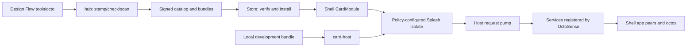

# App Hub code walkthrough

App Hub takes an app from a manifest and a bundle to a verified installation
and a contained UI. Follow that path here, then see where OctoSense adds app
agents and host services. Your build's source versions are in this
workspace's [`Cargo.toml`](../Cargo.toml) and [`Cargo.lock`](../Cargo.lock),
and in
[OctoSense's `Cargo.toml`](https://github.com/OctoSense-org/OctoSense/blob/main/Cargo.toml).

Find your app form in [§1](#1-what-runs-where) and run it with
[§2](#2-run-the-right-host). Then follow its bundle through admission,
mounting and a service reply in
[§3](#3-from-a-manifest-to-a-contained-ui)–[§5](#5-a-host-service-request-line-by-line).
[§6](#6-what-declaring-an-app-agent-enables) follows a request to an app
agent, [§7](#7-source-reference) indexes the crates, and
[§8](#8-debug-by-boundary) maps symptoms to code.

## 1. What runs where

An **app** provides a user interface and data. An **agent** is a model-driven
conversation that can request tools; a **tool** is a named operation with
JSON arguments and a host implementation. **octos** is the Rust agent kernel
that OctoSense runs (`octos-org/octos`). A **peer** is the octos kernel's
identity and routing boundary for one agent. These are logical roles; §5
covers the threads and queues that carry their work.

App Hub supplies package admission, distribution and hosting. OctoSense
supplies the desktop and phone shells, app-agent peers and the octos runtime.
The shell starts model work after it prepares an allowed app peer. The Python
`tools/octo` in Design Flow is a development command, unrelated to octos.

Splash is the Makepad Script runtime that contains an app and draws its UI.

| App form | What executes | Where to start |
| --- | --- | --- |
| Native Rust app | A compiled `AppModule` creates widgets and a `ServiceExecutor` | [`app-host/src/lib.rs`](../crates/app-host/src/lib.rs); native modules live in OctoSense |
| Contained script app | Makepad's Script VM evaluates `main.splash` inside a Splash widget | [`entry.rs`](../crates/app-contract/src/entry.rs), [`card-host/src/host.rs`](../crates/card-host/src/host.rs) |
| L0 card app | `page.card`, its data and a kit are parsed, realized and lowered to Makepad UI | `card_source` and `lower` in [`host.rs`](../crates/card-host/src/host.rs) |

An L0 card goes through the OctoScript parser and the `octoscript-makepad`
lowering, whose output runs in Splash. A native Rust module can also embed
Splash UI; its Rust code is still compiled into its host.

An **isolate** is the app's separate script execution environment. Its
storage **jail** is the directory tree its sandboxed file operations can
reach. A **host sheet** is a panel the host draws over the app, such as a
sign-in form; it runs in an isolate of its own, under no app's policy.



The shell supplies the last two boxes. Standalone `card-host` has a pump but
registers no host services; only App Hub's `runtime` discovery answers there.

<a id="7-run-the-right-host"></a>

## 2. Run the right host

First prepare the sibling sources with Design Flow's
[native workspace instructions](https://github.com/OctoSense-org/OctoScript-App-Design-Flow/blob/main/docs/NATIVE-WORKSPACE.md).
This workspace's [`Cargo.toml`](../Cargo.toml) patches paths to `../makepad`,
`../octoscript-makepad` and `../octoscript`. Without those siblings, even
`cargo metadata` and policy-only tests fail to resolve. Each workspace that
consumes App Hub (a consumer, such as OctoSense) sets these versions through
its own top-level patches. Do not pair the latest Makepad or OctoScript with
another consumer's `Cargo.lock`.

Build `hub` and run the admission tests. These link no Makepad:

```sh
cargo build --release -p octosense-app-hub --bin hub
cargo run -p octosense-app-hub --bin hub -- help
cargo test -p octosense-app-contract -p octosense-app-policy -p octosense-app-hub
```

Build `card-host` and run its tests. These link Makepad:

```sh
cargo build --release -p octosense-card-host
cargo test -p octosense-card-host --test cli
cargo test -p octosense-card-host --bin card-host
```

Run the store's service and host-sheet tests with the default
`text-input-state-query` feature turned off:

```sh
cargo test -p octosense-appstore -p octosense-app-hub-app --no-default-features --lib
```

Every command above passed on macOS on Apple silicon, against sibling
checkouts without OctoSense's runtime patches. Keep these package selections:
[`card-host` fails to build](DEVELOPMENT.md#card-host-fails-to-build) explains
the feature and which builds need the patches. The
[native tools CI](../.github/workflows/native-tools.yml) runs the same builds
and tests on macOS, except `hub -- help`; it makes no GUI or device claim.

Run a disposable, unsigned development bundle (not run here: it needs a
graphical session):

```sh
MAKEPAD_HIDE_WINDOWS=1 MAKEPAD_REMOTE=8141 cargo run --release \
  -p octosense-card-host -- --bundle ~/apps/my-app/bundle \
  --app-data ~/apps/my-app/.local-state --allow-unsigned --stamp
```

That command stays in the foreground. In another terminal:

```sh
curl -s http://127.0.0.1:8141/snap
curl -s http://127.0.0.1:8141/quit
```

`--stamp` rewrites the manifest, so run it on a development copy. `card-host`
uses `RefuseAllSignatures`: `--allow-unsigned` admits an unsigned manifest but
never verifies a signed one, so test signatures through the store. `--system`
changes the admission limits for first-party bundles; it registers no Mail,
model or octos service. Test those services in a shell.

For a native module, the standalone app binary registers `AppHostView` and
calls `open_in(module, open_json)`. In [`app-host`](../crates/app-host/src/lib.rs),
`create` validates the arguments, allocates a Splash VM, supplies scoped
storage, viewport and reply handles, and calls the Rust module. Event and draw
calls enter its VM. The host holds the module's `ServiceExecutor`, but no
agent ever calls the executor, and the host discards the module's upstream
bus messages so the channel never fills. Inside OctoSense, the same module also gets the broker and the
agent integration.

To exercise distribution without publishing, use the
[fixture and preview commands](../crates/app-hub-app/README.md#exercise-installation-without-publishing-apps).
The fixture generates a local catalog and isolated environment settings; only
the full shell opens installed apps as clients. Native app, desktop, Home APK
and ROM build commands belong to the
[OctoSense README](https://github.com/OctoSense-org/OctoSense/blob/main/README.md).

## 3. From a manifest to a contained UI

Follow `policy_for` → `App::mount` in
[`card-host/src/host.rs`](../crates/card-host/src/host.rs):

1. `policy_for` reads `manifest.json`, computes the bundle digest and, with
   `--stamp`, stamps the development copy. `admit_and_resolve_dir` checks the
   bytes and the policy.
2. `policy_for` chooses the default limits for a store app or
   `HostLimits::system()` for a system app. The defaults in
   [`app-contract/src/policy.rs`](../crates/app-contract/src/policy.rs) are
   16 MiB of storage, 64 MiB of heap and 20 million script instructions; the
   system limits are 64 MiB, 128 MiB and 4 billion. Requests above a ceiling
   are clamped, not refused.
3. `isolate_settings` in
   [`containers.rs`](../crates/app-policy/src/containers.rs) chooses
   `<app-data>/<manifest-id>` as the jail. The isolate gets the jail and its
   quota only when the manifest declares `storage`. An `AssetServer` serves
   the bundle's artwork on a loopback port, and only that port joins the
   allowlist.
4. [`splash_adapter::apply`](../crates/app-policy/src/splash_adapter.rs) sets
   the jail, quota, capabilities, prompt permission, host allowlist,
   instruction budget, heap limit and network access **before** evaluation.
5. `card_source` loads `main.splash`, or realizes `page.card` with
   `page.data.json` and `kit/`. Card lowering first tries the measured design;
   an ordinary L0 kit card falls back to the kit lowering. The output enters
   `Splash::set_text` and the Makepad event and draw loop.

A log line that says `agent read-only` reports the resolved agent policy, not
a running agent. `AppPolicy::session_profile` serializes that policy; the
shell builds the peer and the account storage.

## 4. From publication to launch

[`hub.rs`](../crates/app-hub/src/bin/hub.rs) dispatches the CLI commands, and
[`hub-usage.txt`](../crates/app-hub/src/bin/hub-usage.txt) is their syntax.
`stamp` records a digest. `check` calls `check_bundle`: manifest admission,
bundle constraints, listing, references, secret-field checks and agent-file
review. `check` does not judge UI behavior or screenshot quality; reviewers
check those by running the app and reading its captures. `scan` prepares a
review packet and optionally invokes a publishing reviewer command
([`scan.rs`](../crates/app-hub/src/scan.rs)).

`publish` rechecks admission, copies the reviewed bundle and writes a signed
catalog. [`signing.rs`](../crates/app-hub/src/signing.rs) implements the
anchor and working-key trust chain. [`pack.rs`](../crates/app-hub/src/pack.rs)
encodes a bundle for transport. The catalog and artifacts are static files,
served by an HTTP origin or read from a local directory.

On the device, `Origin` in
[`appstore/src/source.rs`](../crates/appstore/src/source.rs) fetches from a
local directory or an HTTP origin. `Store::accept_catalog` verifies the
signature and rejects a sequence older than the catalog it already holds.
Installation checks freshness and the bundle bytes before it writes
`<app-data>/.bundles/<app-id>/bundle`, outside the app's own storage
(`<app-data>/<app-id>/`); an install from before that layout is moved there
once (`adopt_legacy_installs`). The 14-day freshness window applies to new
installs. Installed apps stay subject to `may_run`.

`CardAppView::start` reopens the last verified catalog and calls
`Store::may_run` for an installed app. A withdrawn version is refused at the
next open that uses that catalog. A running instance keeps running until the
host closes it. System apps come from
[`system::prepare`](../crates/appstore/src/system.rs) instead, which unpacks a
compiled-in pack and applies the system limits.

The shell-facing crate is [`app-hub-app`](../crates/app-hub-app/README.md).
Its [`build.rs`](../crates/app-hub-app/build.rs) reads `OCTOSENSE_SYSTEM_APPS`
to pack the selected first-party bundles; without that selection it ships no
system apps. `APP_HUB_MODULE` is the native store UI; `CARD_MODULE` wraps the
common Card runner. The standalone `appstore` binary runs `APPSTORE_MODULE`
from `appstore` through `AppHostView`.

## 5. A host-service request, line by line

Take a granted app that calls `host.request("mail.list", args, callback)`:

1. Makepad's Splash host API checks the capability and queues a request
   identified by `(heap_key, req_id)`. The heap key selects the originating
   isolate, and the request id selects its callback.
2. The runner calls `services::pump` on UI events, never during drawing. It
   collects requests for this app and its visible host sheet only, parses the
   arguments and builds a `ServiceCall` with the app's identity, `from_sheet`,
   `may_prompt` and the host directory. The runner takes its card and sheet
   references before any app widget exists and never looks them up by widget
   id again, so an app widget named `sheet` cannot stand in for the host
   sheet.
3. `dispatch` finds the registered `HostService` for the `mail` family. With
   none registered, the app gets `no service answers "mail" on this device`.
   A request from an app to `mail.sheet.*` is refused before dispatch.
4. The Rust service answers at once or moves its `Replier` to a worker.
   `Replier::send` removes the pending request, queues a JSON reply and wakes
   the UI with `SignalToUI`.
5. A later `pump` delivers the result to the original isolate's callback. A
   late or duplicate reply is ignored. Closing an app calls `cancel_heap` for
   its isolate and for its host sheet's, so a reply meant for either never
   reaches a replacement app instance.

A request waits at most 60 seconds by default; a service may set its own
timeout. Each isolate may have 32 requests pending, and all isolates together
256. Arguments are bounded at 1 MiB and replies at 4 MiB. A host sheet
suspends its request's deadline while it waits for the person. The sheet owns
its isolate and the password input; the app receives the service's result,
never its credential. While the sheet is visible, text, key, IME, clipboard
and pointer-release events reach only the sheet
(`services::is_sheet_input_event`); timers and service replies still reach
the app.

These queues use a `Mutex` and a native `std::thread` timeout sweeper. The
octos side uses async scheduling; see the
[OctoSense walkthrough](https://github.com/OctoSense-org/OctoSense/blob/main/docs/architecture-walkthrough.md#10-map-the-architecture-to-rust-execution).

<a id="6-what-declaring-an-app-agent-actually-enables"></a>

## 6. What declaring an app agent enables

### Follow a request for saved notes

The `mail.list` call in §5 is a UI-to-service request: it needs no model. Now
take a different request, "Summarize my saved notes," sent to an app agent.
Assume the app stores those notes in its account workspace (the folder the
shell exposes to the app's agent) and the person has
allowed its agent in the OctoSense shell.

1. The person opens the desktop `Ask <app>` panel and sends the request. The shell
   selects that app's peer (the agent identity) and its human conversation.
   An app-owned chat can instead enter through `octos.turn.start`, using the
   host-request transport from §5 to reach the shell's agent service.
2. On Unix, the model can request the shell's bounded `files.list`,
   `files.read` and `files.search` tools. They read the account workspace;
   declaring `tools.json` does not make every UI record readable.
3. Tool results return to the model, which answers in the originating human
   conversation. When the system agent delegates the same question, it
   uses the app peer's separate system conversation and collects that
   conversation's result instead.
4. A follow-up that needs another app's operation must pass that tool's
   admission, sharing and execution checks. Adding `mail.send` to
   `agent.tools`, for example, fails default admission; it is not a working
   cross-app recipe.

Three separate decisions meet here: admission grants what the app may
request, the shell supplies tools that execute, and the active
conversation decides where the answer returns. Standalone `card-host` stops
before this agent path: it has no registered services and no agent runtime.

### Declarations and executable tools

`AgentBundle::load` checks the digest again and validates the declaration.
`tools.json` describes tool names, schemas, risk, sharing, confirmation and
implementation ownership. A contained app's namespace is the last segment of
its id; a native module uses its module id. `shareable: true` means a tool can
be granted to another caller; the caller still needs that grant.

`agent.tools` asks for tools from outside this manifest. In contained app
policy, `ask_user_question` is the only plain kernel-tool name allowed. Dotted
names must also be offered by the host. The default offer list is in
`HostLimits`, and default admission rejects any name outside it, including
`mail.send`.

A shell can widen the offer for a shipped system app only. The shell calls
`appstore::system::set_agent_tool_offer(app_id, names)` before
`system::prepare` admits that app. The offer is scoped to that system id, and
every `prepare` checks it, including for cached bundles. OctoSense offers the Mail app three
Calendar tools: `calendar.events`, `calendar.add_event` and `calendar.notify`.
The shell relay still checks the owning tool's sharing flag and the caller's
grant before its executor runs. Store-app admission and raw UI capabilities do
not change.

What App Hub checks, and what the OctoSense shell on its main branch does with
each declaration:

| Layer | App Hub | OctoSense shell |
| --- | --- | --- |
| `agent`, model needs, background and triggers | Parsed and validated; budgets resolved | Runs two triggers: `mail.messages.new` for Mail, and `<namespace>.new_message` for a `background: true` store app granted `auth` and `gmail` with a connected Google account. Model needs do not select a model. |
| `AGENT.md` and `skills/` | Reviewed and loaded into `AgentBundle` | Passed to the app's peer as per-turn guidance (`agent_events::install_guidance`). They are not installed as kernel skills and grant no tools. |
| `tools.json` | Names, schemas and policy checked | `implemented_by: "host-service"` tools run on a registered service (below); `implemented_by: "app"` tools run in the open full app through the `app_tools.dispatch@1` runtime ABI; a closed app returns `app_not_running` |
| Agent account data | The contract has `storage.accounts` and `agent_workspace` | The shell builds the account workspace and its bounded read tools |
| Human or app conversation | No chat runtime in `card-host` | Shell consent, the app peer and the chat surfaces |

OctoSense's
[`script_apps.rs`](https://github.com/OctoSense-org/OctoSense/blob/main/crates/shell/src/host_tools/script_apps.rs)
draws the implementation boundary. It loads each bundle with App Hub's
`AgentBundle::load` and installs a `HostServiceExecutor`:

- A tool marked `implemented_by: "host-service"` runs on the registered
  service of its namespace (`news.list` runs on the `news` service), with the
  app's identity. The manifest must request that family's capability, or the
  family must be a system app's own.
- A tool can name a `host_method` instead: a reviewed shared-service method
  from `SHARED_HOST_METHODS` in
  [`app-policy/src/agent.rs`](../crates/app-policy/src/agent.rs), such as
  `github.read`, `gmail.messages` or `glance.publish`. The tool keeps its name
  in the app's namespace, and the executor dispatches it to that method as the
  app. Admission requires `implemented_by: "host-service"`,
  `private_data: true`, at least the method's minimum risk, and the method's
  family among the manifest's capabilities.
- For the `github`, `gmail` and `gcalendar` families, the executor adds the
  app's active connection to the arguments; a tool cannot choose another.
- A tool marked `implemented_by: "app"` uses the `script-tools-v1` runner:
  `script_tools::submit` queues validated JSON with host identity; the full
  `CardAppView` calls `script_tools::pump` on the UI thread and invokes the
  signed `app_tool` hook in its existing Splash VM. The script reads its
  request and completes through `mod.app_tools`. Closed apps fail explicitly.
  Earlier host releases refuse script dispatch. The generic module bus
  `CardExecutor` in [`cardapp.rs`](../crates/appstore/src/cardapp.rs) remains
  unavailable; the admitted app-agent relay uses this dedicated queue.

Existing system apps supply Rust service handlers; a store bundle cannot add
one by shipping JSON.

The system bundles show the split:

| System app | Declared tools |
| --- | --- |
| News | `news.list`, `news.read` and `news.notify` |
| Mail | Account-scoped reads (`mail.accounts`, `mail.folders`, `mail.list`, `mail.sync`, `mail.peek`, `mail.draft`); cards (`mail.notify`, `mail.publish_card`); `mail.skip_event` for incoming-mail events; reply proposals (`mail.propose_reply`, `mail.suggest_reply`, `mail.propose_send`) |
| Calendar | Events (`calendar.events`, `calendar.add_event`, `calendar.update_event`, `calendar.remove_event`) and cards (`calendar.notify`, `calendar.agenda`) |
| Photos, Maps, Camera, YouTube | Only their own `<namespace>.notify`, which the shell's shared [`glance_notice` service](https://github.com/OctoSense-org/OctoSense/blob/main/crates/shell/src/glance_notice.rs) executes |
| AI providers | None: its `ai-providers` namespace fails the tool-name rule (`[a-z0-9_]`) |

A `notify` declaration adds an agent and a notice route, not general access to
camera controls or photo records. The shell's
[`script_apps` tests](https://github.com/OctoSense-org/OctoSense/blob/main/crates/shell/src/host_tools/script_apps.rs)
pin these rosters.

### Conversation routing and data access

The shell supplies the desktop `Ask <app>` panel, app-owned `octos.*` UI and
supported L0 card chat.
[Where the person talks](https://github.com/OctoSense-org/OctoSense/blob/main/docs/architecture-walkthrough.md#6-where-the-person-talks),
in the OctoSense walkthrough, lists their entry points. The system agent discovers permitted, prepared peers
and delegates by their peer slug. A system request and a human request
can reach the same app peer in separate conversations, which OctoSense calls
lanes, and each reply is routed back to its requester. Each lane owns its transcript; a lane that
shares context receives bounded recent history from the other lane, and the
shell panel can display both.

The account workspace is the active account's folder: `accounts/device/` for
a single-account app. The `files.*` tools from step 2 appear only when the
person has consented and the account workspace is available. App-owned records
must be in the account workspace or reachable through an implemented tool. A Rust host
service's `.host` state and secrets stay outside it. See
[`app_storage`](https://github.com/OctoSense-org/OctoSense/tree/main/crates/shell/src/app_storage)
and [`app-peers/storage.rs`](https://github.com/OctoSense-org/OctoSense/blob/main/crates/app-peers/src/storage.rs).

Cross-app tools require the owner's declaration, `shareable`, the caller's
grant and an executable owner route, plus approval where required. Contained
app agents cannot call `peer_send_input` or gain system-agent privileges
through this tool route.

<a id="2-read-the-crates-in-this-order"></a>

## 7. Source reference

Use this index to revisit the path traced above. The first seven files cover
admission through reply delivery; the table covers the other hosts and the
authoring support.

1. [`app-contract/src/lib.rs`](../crates/app-contract/src/lib.rs): defines the
   shared, versioned data contract. `AppManifest` describes requests; `AppPolicy`
   describes grants. The shell uses these declarations when it prepares an
   authorized octos session.
2. [`app-policy/src/policy.rs`](../crates/app-policy/src/policy.rs): resolves
   the app contract and the agent requests against `HostLimits`.
3. [`app-policy/src/agent.rs`](../crates/app-policy/src/agent.rs): validates
   `tools.json`, instructions and skills, and constructs an `AgentBundle`.
4. [`app-hub/src/gate.rs`](../crates/app-hub/src/gate.rs): produces the same
   admission report for local development and for publication.
5. [`app-hub/src/client.rs`](../crates/app-hub/src/client.rs): implements the
   device's `Store`: catalog verification, installation and permission to run.
6. [`appstore/src/cardapp.rs`](../crates/appstore/src/cardapp.rs): mounts a
   verified app in its own shell client.
7. [`appstore/src/services.rs`](../crates/appstore/src/services.rs): routes
   script host requests and delivers replies.

The remaining crates and directories complete the delivery path:

| Path | Role and next file |
| --- | --- |
| [`card-host`](../crates/card-host/src/main.rs) | Standalone contained bundle runner; argument parsing leads to `host::run` |
| [`app-host`](../crates/app-host/src/lib.rs) | One-window host for a compiled Rust `AppModule` |
| [`app-hub-app`](../crates/app-hub-app/README.md) | Shell integration: native store, Card runner, packed system apps and icons |
| [`appstore-app`](../crates/appstore-app/src/lib.rs) | Standalone `appstore` executable using `AppHostView` |
| [`card-studio`](../crates/card-studio/src/main.rs) | Hidden `card-host` captures at glance, phone and desktop sizes; measured checks and critique payload |
| [`skills/card-studio`](../skills/card-studio/SKILL.md) | octos skill exposing card rendering and critique preparation |
| [`templates/app`](../templates/app/README.md) | Card-app scaffold with bundle metadata and contributor instructions |

OctoSense consumes a git revision of App Hub, selected by its `Cargo.toml`.
App Hub's `app-policy` requires `octosense-app-contract = "1.7"`. OctoSense
`main` does not patch the contract: its `Cargo.lock` resolves the version it
asks for from crates.io, and the host API work needs 1.6 or later. OctoSense
desktop 0.1.0-beta.2 patched crates.io's copy with its App Hub revision
(`[patch.crates-io]`) and resolved 1.5.0 from git. This workspace patches the
dependency to `crates/app-contract` for development. Cargo applies patches
only from the top-level workspace, so no patch reaches a consumer: each
consumer sets its own ([Versions on crates.io](../crates/app-contract/README.md#versions-on-cratesio)).

## 8. Debug by boundary

| Symptom | First source or check |
| --- | --- |
| Cargo cannot find a manifest under a sibling path | Workspace patches and prepared runtime pins |
| Bundle refused | `hub check`; `gate.rs`, contract and policy resolution, and the digest |
| App admitted, blank UI | `card-host` log, `/snap`, script parse and lowering, and asset paths |
| `no service answers` | `register_host_service` in the shell, not more bundle capabilities |
| A store tool answers `app_tool_unavailable` or `app_not_running` | Check that the host advertises `app_tools.dispatch@1`, that the manifest requires `script-tools-v1` and that the owning full app is open; Glance alone does not start script tools (`script_apps.rs`, `script_tools.rs`) |
| Agent tool appears but fails | Owner, grant and executor route in the shell's `host_tools`; JSON is not an implementation |
| Agent cannot see app records | Active account workspace and file placement, then the read tools' limits |
| App peer absent | Shell consent and peer preparation; `card-host` has no peer list |
