# App Store Delivery Architecture and Execution Guide

> **For implementers:** REQUIRED SUB-SKILL: Use superpowers:executing-plans to implement the selected feature plan task-by-task.

**Goal:** Deliver a simple, dependable free Card-app store, then expand marketplace capabilities without rebuilding the distribution foundation.

**Architecture:** Preserve the signed static catalog/artifact delivery path. Add a small authenticated publishing service, isolated validation/review workers, and a protected signer; share the Card runtime and validation contract across developer tools and installed hosts.

**Tech Stack:** Existing Rust, serde/JSON, ed25519/BLAKE3, Makepad and Octoscript. Proposed service stack: Rust HTTP routing with Axum/Tokio, SQLite for transactional identity/submission state, a filesystem blob adapter initially, and interfaces for identity, keys, storage and notifications. Select and pin compatible maintained dependency releases when implementation begins; no unverified library versions are prescribed here.

**Status:** Proposed implementation design, 2026-09-24. The user explicitly selected **free Card apps first; native apps and payments later**. No feature implementation or deployment has occurred as part of this planning task.

## Scope and alternatives

| Approach | Benefits | Limitations | Decision |
| --- | --- | --- | --- |
| Small service + CLI/action + signed static delivery | One ownership/status API; private beta and recovery can grow naturally; reuses device verification | Requires operating a modest service/database and worker queue | Recommended baseline |
| GitHub-only PR/bot workflow | Low initial hosting work and visible review history | Awkward private uploads, non-GitHub developers, ownership recovery and release status; still needs protected signing | Possible pilot adapter to the same contracts; avoid making GitHub PR shape the permanent API |
| Full portal, large backend and custom analytics immediately | Broad product surface | Delays the first useful external app and multiplies work before adoption is known | Add focused console views after the core workflow works |

Card apps remain the initial supported downloadable format. An installable SDK must support useful logic, persistence, network access and a tested service matrix. A native package is a separate artifact kind and OS installer path, not a downloaded Rust module loaded into the shell. Commerce is a separate entitlement subsystem. Neither optional track gates free Card launch.

## Repository ownership

All file tables use these exact roots relative to the outer shared workspace. Links in plans resolve to existing or proposed paths.

| Alias | Repository root | Responsibility |
| --- | --- | --- |
| H | `OctoSense-App-Hub/` | Policy, catalog/client, runtime adapters, CLI/SDK, service, validation, release operations and shared documentation |
| M | `OctoSense-mobile/` | Current mobile store, shell lifecycle, device adapters and installed app UX |
| F | `makepad/` | Isolate host bridge, native widgets, service engine and OS integration primitives |
| K | `octoscript-makepad/` | Card preparation, kit widgets and application event adaptation |
| S | `octoscript/` | Script language, storage/capability primitives when existing APIs need extension |

Inspect each repository's current `AGENTS.md`, worktree state and pins before implementing there. Do not mutate a user's shared dirty checkout to satisfy a build. Use isolated coordinated checkouts for cross-repository development. Land/release shared runtime changes first, then update Hub/mobile dependency revisions and lockfiles explicitly; local path patches alone are not a shippable integration. Plans identify ownership, not permission to edit unrelated local work.

New module files require the owning `lib.rs`/`mod.rs` registration. New crates require a workspace member, crate manifest and updated lockfile. Only intentional dependency changes should update lockfiles; subsequent verification uses `--locked`. Package/test names in plans are proposed names that the corresponding task creates, not claims those targets already exist.

## System boundaries

```mermaid
flowchart LR
    Dev[Developer source] --> SDK[hub new / dev / test]
    SDK --> Artifact[Signed immutable bundle]
    CI[GitHub release action] --> API[Publishing API]
    Artifact --> API
    API --> Registry[Publisher and app ownership]
    API --> Queue[Durable submission jobs]
    Queue --> Validate[Isolated validation and review]
    Validate --> Approval[Digest-bound approval]
    Approval --> Signer[Protected release signer]
    Signer --> Public[Signed catalog and immutable artifacts]
    Public --> Device[Verified device client]
    Device --> Runtime[Contained app runtime]
    Runtime --> Broker[Authorized host services]
```

The publishing service accepts authenticated artifacts and records transitions. It does not run app code inside an API request. Validation workers have bounded CPU/memory/time/output, no production signing credentials and no ambient access to the service database or unrelated publisher data. The signer consumes approved release records and publishes complete generations; it does not check out publisher repositories or execute reviewer command strings supplied by publishers.

Use transactional SQLite state and a leased job/outbox design for the initial single-region service. One writer serializes catalog generations. This is deliberately a small deployment, not a microservice fleet; the isolation boundary for untrusted execution still needs a separate worker process/container. Database and artifact adapters allow later changes without rewriting the CLI/device protocols.

## Shared contracts and migration rules

- **Identity:** account, publisher, app, key and release are distinct identities. Human-readable names are not ownership or signing authority. Bind update verification to recorded public keys; an upload cannot replace the registry mapping.
- **Release identity:** immutable app ID + release number + manifest/artifact digest. Human version strings are presentation. v2 uses valid SemVer for display and a monotonically increasing release number for ordering; channel targets and explicit rollback policies select versions.
- **Signing:** preserve v1 canonical bytes exactly. Adding defaulted fields to old structs can invalidate historical signatures. Use separate wire-versioned types and golden fixtures; ship new readers before new writers and keep a legacy endpoint during migration.
- **Runtime compatibility:** a host advertises supported API/build/platform/service versions. A release declares required features. Listing platforms describe testing; they cannot grant capabilities or replace runtime requirements.
- **Launch vs update:** launch checks the installed release's exact approval, integrity, permissions and revocation. Update selection finds the best compatible allowed candidate. A new release does not itself revoke older ones.
- **Permission changes:** compare resolved semantic grants including network hosts, tools and budgets where material. Broader grants require consent; a changed listing description alone is not a permission delta.
- **App code vs data:** immutable reviewed code is separate from the writable data jail. Code changes require a new digest/release; state and migrations operate only on app-owned data.
- **Review:** approval references exact digest, validator/runtime identity, policy version and decision-maker. First-publisher checks are explicit. Failing or missing validation never becomes approval; `--reviewed` cannot authorize public publication.
- **Private audiences:** beta catalog and artifact access are both authenticated. A raw public URL with an obscure name is not private. Separate public/beta/developer caches, trust state and entitlement semantics.
- **Recovery:** rollback creates a newer signed catalog generation pointing to a permitted target. Keep release history and revocation/key high-water marks; never replay an old catalog or silently reset user data.
- **SDK:** one author config and a lockfile produce the release manifest/listing. Examples, generated outputs, signing keys, local state and review reports have explicit inclusion/exclusion rules. Required artwork comes from a real running app.

## Authentication and signing custody

Begin with authenticated browser/device login and a local publisher key held by an OS keystore. Register that key with an ownership check and proof of possession. CI can use an explicitly enrolled protected publisher-key adapter; optionally offer managed per-publisher signing after its custody/recovery model is selected. Managed publisher keys remain separate from the Hub catalog key. Describe the account-compromise tradeoff of managed signing rather than claiming it gives the same custody guarantees as an offline developer key.

GitHub OIDC can supply a short-lived workflow identity, but authorization must bind the issuer, audience, stable repository/owner IDs, allowed workflow/ref/environment and publisher/app scope. OIDC identity alone does not prove artifact safety or permit key replacement. GitHub documents OIDC's short-lived identity exchange and cautions against privileged execution of untrusted workflow content. [GitHub OIDC](https://docs.github.com/en/actions/concepts/security/openid-connect), [secure workflow use](https://docs.github.com/en/actions/reference/security/secure-use).

Local fixtures use fresh test keys and a test anchor. Never distribute an SDK or shell release configured to trust that fixture anchor as production.

## Implementation cycle and validation

For each task in a feature plan:

1. Read the owning code and write the named regression/acceptance scenario with realistic inputs. Start from the review probe for the three reproduced defects. Do not write assertions that only mirror internal implementation details.
2. Run the new case and confirm the expected behavior is missing. If it already passes, investigate the actual execution path before changing code.
3. Implement the narrow contract described by the task. Keep APIs shared where local tools, server validation and the device must agree.
4. Run the targeted case and affected suite. Add native/device verification for runtime/UI/service changes; a fake adapter proves routing, not a functioning Android camera or screen reader.
5. Inspect the diff, update the relevant docs, and commit the independently reviewable slice. Stage only files belonging to that slice and repository. Use @superpowers:verification-before-completion before success claims.

For low-impact documentation, schema examples or simple presentation copy, review/link/schema checks may be sufficient; do not create tests that merely restate text. Adversarial identity/admission, crash recovery, installation, migration and lifecycle behavior require meaningful regression tests. Preserve the existing mobile staging/consent/data tests rather than replacing them with mocks.

Task actions are intended to be small. Large plans marked L/XL must be delivered as several PRs at their listed task boundaries; split further when a task cannot be tested and reviewed independently. S/M/L/XL indicate complexity only. No calendar estimates or staffing assumptions have been invented.

All plan commands are **future verification commands** unless explicitly identified as review evidence. The review's 78 passing tests do not establish that these new features exist. Dependency fetches, supported graphical runners, platform credentials and device availability must be prepared when executing the relevant test. Run tests without network where practical, using local fake identity/payment/blob/model adapters.

## Decisions needed during implementation

| Decision | Recommended starting point | Work that can proceed now | Needed before |
| --- | --- | --- | --- |
| Production hosting/region | Single-region service, durable database/objects and isolated workers | Local service, contracts, job state machine, test deployment | External pilot deployment |
| Developer identity provider | GitHub initially behind an adapter; keep app ownership provider-neutral | Mock provider, token/ownership tests, CLI device flow | Real account login |
| Signing custody | Local OS keystore; protected operator signer; explicit CI enrollment | Signing interfaces, trust tests, enrollment schema | CI/public signing activation |
| Supported runtime/platform matrix | Test macOS developer tools and Android device flow first; advertise only measured support | Portable core, fixtures, compatibility rules | SDK/app platform claims |
| Review ownership and response target | Human review first, automation only with evidence | Queue, decision model, publisher feedback UI | Outside submissions |
| Diagnostic retention and support ownership | Minimal event allowlist and opt-in client collection | Local logs, redaction tests, server health metrics | Client telemetry collection |
| Commercial model/native targets | Deferred by user choice | Separate adapter contracts and feasibility prototypes | Optional paid/native launch |

These are explicit decisions, not unanswered questions blocking this planning deliverable. The feature plans define local/mock paths so implementation can make progress before production accounts or providers are selected.

Native distribution needs a fresh platform review at execution time. Android provides OS package installation APIs; Apple's distribution and runtime rules differ and must not be generalized from Android or an old ADR. [Android PackageInstaller](https://developer.android.com/reference/android/content/pm/PackageInstaller), [Apple review guidelines](https://developer.apple.com/app-store/review/guidelines/).

## Execution handoff

Start with Plan 01, then Plan 02 and Plan 03; establish Plan 26's CI scaffolding alongside them. Use the roadmap's dependency order for subsequent work. The documents are ready for feature-by-feature execution; this task only creates plans and does not change application behavior, commit existing unrelated files or deploy anything.
