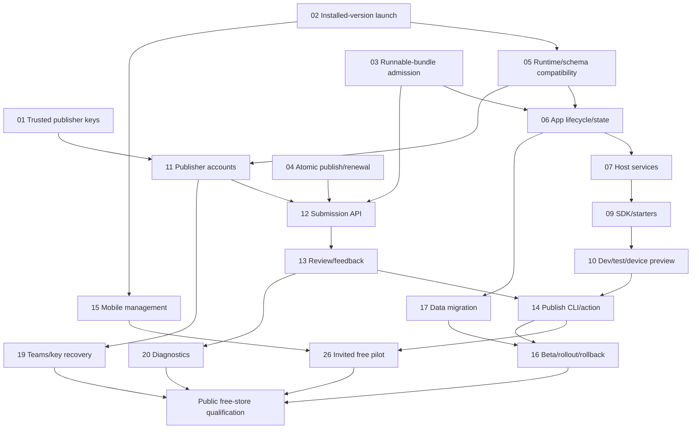

# App Hub to App Store: Prioritized Roadmap

**Goal:** Resolve every issue in the [store-readiness review](../reviews/2026-09-24-store-readiness.md) and deliver a simple outside-developer workflow.

**Confirmed scope:** Free Card apps first; native applications and payments later. This roadmap includes those later tracks without making them launch dependencies.

**Deliverables:** 26 individual implementation plans, a [shared architecture/execution guide](2026-09-24-app-store-design.md), explicit dependencies, review coverage and stage acceptance gates.

**Status:** Implementation in progress. Plans **01–02 verified locally** (2026-09-25); plan **03 verified locally**. Plans 04–26 are not started. No deployment is claimed.

## Priority order

Rank expresses importance. Plan IDs are stable references, not a promise of strict numerical execution order. Follow prerequisites; independent SDK/client and publishing-service work can progress once their shared foundations are ready.

P0 = required for a dependable invited free-Card pilot. P1 = required for the broader public free-store beta described below. P2 = growth or optional product expansion. Complexity S/M/L/XL is relative; no ungrounded dates or staffing estimates are implied.

| Rank | Priority | Implementation plan | Why this order | Dependencies | Size |
| --- | --- | --- | --- | --- | --- |
| 1 | P0 | [01 — Publisher key continuity and signed release identity](2026-09-24-store-01-publisher-key-continuity.md) | Protect app ownership before automating submissions. | — | S |
| 2 | P0 | [02 — Installed-version launch and precise revocation](2026-09-24-store-02-installed-version-launch.md) | Do not break installed apps when developers publish updates. | — | M |
| 3 | P0 | [03 — Runnable bundle admission and actionable validation](2026-09-24-store-03-bundle-admission.md) | Do not distribute apps that cannot run. | 01 | M |
| 4 | P0 | [04 — Atomic catalog publication, renewal and signing operations](2026-09-24-store-04-catalog-release-operations.md) | Keep the store fresh, complete and recoverable. | 01 | M |
| 5 | P0 | [05 — Versioned runtime contracts and release compatibility](2026-09-24-store-05-runtime-compatibility.md) | Establish compatibility before publishing an SDK contract. | 02 | L |
| 6 | P0 | [06 — Card application lifecycle, state and effects](2026-09-24-store-06-card-application-runtime.md) | Enable useful apps with logic and durable state. | 03, 05 | L |
| 7 | P0 | [07 — Host services, capability matrix and structured network policy](2026-09-24-store-07-host-services.md) | Make permissions correspond to tested services. | 05, 06 | L |
| 8 | P0 | [11 — Publisher authentication, namespace ownership and registry](2026-09-24-store-11-publisher-accounts.md) | Create verified ownership for outside developers. | 01, 05 | L |
| 9 | P0 | [12 — Immutable artifact upload and submission API](2026-09-24-store-12-submission-api.md) | Create the actual artifact/submission path. | 03, 04, 11 | L |
| 10 | P0 | [13 — Review decisions, publisher feedback and abuse handling](2026-09-24-store-13-review-and-moderation.md) | Bind approval to evidence and give publishers feedback. | 03, 11, 12 | L |
| 11 | P0 | [09 — Installable SDK, pinned runtimes and runnable starters](2026-09-24-store-09-sdk-and-starters.md) | Remove framework setup and provide working examples. | 05, 06, 07 | L |
| 12 | P0 | [10 — Development loop, signed device preview and editor tooling](2026-09-24-store-10-development-and-testing.md) | Make development, testing and signed device preview simple. | 03, 06, 07, 09 | L |
| 13 | P0 | [14 — One-command publishing and GitHub release action](2026-09-24-store-14-publish-cli-and-ci.md) | Connect the developer journey end to end. | 09, 10, 11, 12, 13 | L |
| 14 | P0 | [15 — Mobile uninstall, complete listings and user controls](2026-09-24-store-15-mobile-app-management.md) | Finish the current mobile app lifecycle and listing information. | 02 | M |
| 15 | P0 — Release gate | [26 — Continuous integration and outside-developer launch qualification](2026-09-24-store-26-ecosystem-qualification.md) | Prove the entire free-app journey before launch. | 01, 02, 03, 04, 05, 06, 07, 09, 10, 11, 12, 13, 14, 15 | M |
| 16 | P1 | [19 — Publisher teams, transfer, key recovery and trust revocation](2026-09-24-store-19-publisher-recovery-and-trust.md) | Handle organizations, lost keys and trust incidents. | 01, 04, 05, 11 | L |
| 17 | P1 | [17 — App data migrations, recovery and functional rollback](2026-09-24-store-17-data-migrations.md) | Prevent updates/rollback from corrupting user data. | 02, 05, 06 | L |
| 18 | P1 | [16 — Private testing, release channels and controlled rollouts](2026-09-24-store-16-release-channels.md) | Control private testing and release exposure safely. | 02, 04, 05, 12, 13, 14, 17 | L |
| 19 | P1 | [20 — Release diagnostics, developer console and operations health](2026-09-24-store-20-diagnostics-and-developer-console.md) | Make failures visible and operations supportable. | 11, 12, 13, 06 | L |
| 20 | P1 | [18 — Download queue, resume, cancellation and automatic updates](2026-09-24-store-18-download-and-update-management.md) | Improve installation on real networks and safe update automation. | 02, 04, 05, 15, 17 | L |
| 21 | P1 | [22 — Localization, accessibility and developer quality tooling](2026-09-24-store-22-localization-and-accessibility.md) | Qualify accessible, localized store and app experiences. | 05, 06, 09, 10, 15 | L |
| 22 | P1 | [08 — Contained app tools and AI ecosystem integration](2026-09-24-store-08-ai-ecosystem.md) | Deliver the promised OctoSense AI/tool integration. | 05, 06, 07 | L |
| 23 | P2 | [21 — Discovery, ratings, user reviews and publisher replies](2026-09-24-store-21-discovery-and-reviews.md) | Improve adoption once real apps/users exist. | 11, 13, 20 | L |
| 24 | P2 | [23 — Efficient artifacts and scalable signed catalog delivery](2026-09-24-store-23-distribution-scaling.md) | Optimize only when measured delivery limits justify it. | 04, 05, 18, 20 | L |
| 25 | P2 — Optional | [24 — Paid apps, entitlements, subscriptions and settlement](2026-09-24-store-24-commerce.md) | Optional revenue system after the free store succeeds. | 11, 13, 16, 19, 20 | XL |
| 26 | P2 — Optional | [25 — Native application distribution feasibility and implementation](2026-09-24-store-25-native-distribution.md) | Separate optional native-platform distribution decision. | 04, 05, 11, 12, 13, 19 | XL |

Compatibility moves earlier than in the review's broad phases because the runtime, SDK, channels and update resolver need one stable contract. Mobile uninstall can ship early alongside the client fixes. Plan 26's CI work begins immediately even though the full qualification gate cannot pass until the features exist.

## Execution sequence

| Wave | Work | Completion gate |
| --- | --- | --- |
| A: correct existing behavior | 01, 02, 03, 04; 26 CI scaffolding | All three reproduced defects have meaningful passing regressions; renewal and transactional publication are demonstrated with test keys. |
| B: establish app/platform contracts | 05; then 06 and 07. Ship 15 independently after 02. Begin 11 after 01/05. | A real contained app handles input, persists state and uses only supported services; v1 signing compatibility remains intact. |
| C: connect developers to publishing | 09 → 10; 11 → 12 → 13; then 14. | A clean external project can build, test, sign, upload and track a reviewed release without Hub repository access or Hub keys. |
| D: qualify the invited free pilot | 26 pilot checks with all P0 plans | Outside developers complete install/use/update/uninstall; failure drills preserve trust and data. |
| E: prepare a broad public free beta | 19 and 17; 16 after 17/14; 20; 18; 22; 08. Extend 26 qualification. | Private testing, rollout/recovery, diagnostics, accessibility and scoped AI integration work on the advertised runtime/device matrix. |
| F: grow based on evidence | 21; 23 only after measurement | Real discovery/community feedback and demonstrated distribution performance improvements. |
| G: optional new products | 24 and/or 25 after their own decisions | Provider sandbox or native platform qualification succeeds before any paid/native public activation. |

No later feature should hide a broken earlier lifecycle. Do not build a developer dashboard around manual publication; the dashboard must consume the same working ownership/submission/review APIs as the CLI.

## Main dependency graph

The diagram shows the main path; the table and individual plans contain all prerequisites, including download management, accessibility and AI integration for the public-beta gate.

## Release acceptance gates

**Invited free pilot:** use packaged tools, a staging or explicitly scoped pilot catalog, real signed artifacts and a non-organization publisher. Demonstrate login → create → edit → test → submit → review → install → use → save/restart → publish v2 while v1 still opens → update with data preserved → uninstall. Require scheduled catalog freshness and a staffed review/support owner. Do not advertise capabilities or OSes supported only by mocks.

**Public free beta:** pass the pilot again plus private beta membership/artifact access, release promotion and halt, safe data migration/rollback, identity/key recovery, real-network download interruption, opted-in diagnostics, accessibility checks and the supported OctoSense AI integration. Store health and incident runbooks must be exercised. Permissions broaden only with explicit user consent.

**Usability targets:** a functioning preview within 15 minutes and first beta submission within 30 minutes excluding review, measured with at least three developers unfamiliar with the repositories. Before private beta support is available, measure a pilot submission instead and label it accurately. These are proposed success criteria, not measured current results.

**Growth/optional gates:** ratings require real users and moderation; scaling requires measured thresholds. Payments require sandbox reconciliation and a chosen commercial operating model. Native distribution requires a per-platform feasibility decision and device proof. Neither is required to launch the free Card store.

## Review coverage

Every issue from the review is represented below. Closely related observations are grouped so one shared implementation fixes the same problem in CLI, backend and mobile instead of creating conflicting solutions.

| Issue | Review finding | Plans |
| --- | --- | --- |
| R01 | A different public key under the same publisher ID passes continuity | [01 — Publisher key continuity and signed release identity](2026-09-24-store-01-publisher-key-continuity.md); [19 — Publisher teams, transfer, key recovery and trust revocation](2026-09-24-store-19-publisher-recovery-and-trust.md) |
| R02 | An ordinary update blocks the older approved installed version | [02 — Installed-version launch and precise revocation](2026-09-24-store-02-installed-version-launch.md) |
| R03 | Missing Card/kit and invalid screenshot bytes pass admission | [03 — Runnable bundle admission and actionable validation](2026-09-24-store-03-bundle-admission.md) |
| R04 | Outside publishers lack a real submission/API/action path; public signing requirements are inconsistent | [01 — Publisher key continuity and signed release identity](2026-09-24-store-01-publisher-key-continuity.md); [11 — Publisher authentication, namespace ownership and registry](2026-09-24-store-11-publisher-accounts.md); [12 — Immutable artifact upload and submission API](2026-09-24-store-12-submission-api.md); [14 — One-command publishing and GitHub release action](2026-09-24-store-14-publish-cli-and-ci.md) |
| R05 | SDK requires sibling source checkouts; starter is not runnable; developer setup is manual | [09 — Installable SDK, pinned runtimes and runnable starters](2026-09-24-store-09-sdk-and-starters.md); [10 — Development loop, signed device preview and editor tooling](2026-09-24-store-10-development-and-testing.md); [14 — One-command publishing and GitHub release action](2026-09-24-store-14-publish-cli-and-ci.md) |
| R06 | No complete app logic/event/state/effect entrypoint contract | [06 — Card application lifecycle, state and effects](2026-09-24-store-06-card-application-runtime.md) |
| R07 | Declared host/AI capabilities are not a complete wired runtime API | [07 — Host services, capability matrix and structured network policy](2026-09-24-store-07-host-services.md); [08 — Contained app tools and AI ecosystem integration](2026-09-24-store-08-ai-ecosystem.md) |
| R08 | Optional reviewer, unrecorded approval, missing runtime evidence, timeout and publisher-feedback gaps | [03 — Runnable bundle admission and actionable validation](2026-09-24-store-03-bundle-admission.md); [12 — Immutable artifact upload and submission API](2026-09-24-store-12-submission-api.md); [13 — Review decisions, publisher feedback and abuse handling](2026-09-24-store-13-review-and-moderation.md) |
| R09 | Broad URL text rejection and incomplete resource-aware validation | [03 — Runnable bundle admission and actionable validation](2026-09-24-store-03-bundle-admission.md); [07 — Host services, capability matrix and structured network policy](2026-09-24-store-07-host-services.md) |
| R10 | No runtime/platform/required-feature compatibility contract | [05 — Versioned runtime contracts and release compatibility](2026-09-24-store-05-runtime-compatibility.md) |
| R11 | Opaque versions and append-order release selection | [05 — Versioned runtime contracts and release compatibility](2026-09-24-store-05-runtime-compatibility.md); [16 — Private testing, release channels and controlled rollouts](2026-09-24-store-16-release-channels.md) |
| R12 | Missing verified ownership, namespace claims, teams, transfer and recovery | [11 — Publisher authentication, namespace ownership and registry](2026-09-24-store-11-publisher-accounts.md); [19 — Publisher teams, transfer, key recovery and trust revocation](2026-09-24-store-19-publisher-recovery-and-trust.md) |
| R13 | Current mobile UI has no uninstall/data-deletion flow | [15 — Mobile uninstall, complete listings and user controls](2026-09-24-store-15-mobile-app-management.md) |
| R14 | Mobile details omit existing support/privacy/platform/age/license metadata | [15 — Mobile uninstall, complete listings and user controls](2026-09-24-store-15-mobile-app-management.md); [22 — Localization, accessibility and developer quality tooling](2026-09-24-store-22-localization-and-accessibility.md) |
| R15 | Catalog freshness expires without scheduled renewal | [04 — Atomic catalog publication, renewal and signing operations](2026-09-24-store-04-catalog-release-operations.md) |
| R16 | Publication/signing/backup/monitoring and key-revocation operations incomplete | [04 — Atomic catalog publication, renewal and signing operations](2026-09-24-store-04-catalog-release-operations.md); [19 — Publisher teams, transfer, key recovery and trust revocation](2026-09-24-store-19-publisher-recovery-and-trust.md); [20 — Release diagnostics, developer console and operations health](2026-09-24-store-20-diagnostics-and-developer-console.md) |
| R17 | No private beta, channels, release scheduling, rollout/halt or functional rollback | [16 — Private testing, release channels and controlled rollouts](2026-09-24-store-16-release-channels.md) |
| R18 | No data schema/migration/backup/rollback contract | [17 — App data migrations, recovery and functional rollback](2026-09-24-store-17-data-migrations.md) |
| R19 | No integrated reports, moderation, appeals and user support path | [13 — Review decisions, publisher feedback and abuse handling](2026-09-24-store-13-review-and-moderation.md); [15 — Mobile uninstall, complete listings and user controls](2026-09-24-store-15-mobile-app-management.md); [21 — Discovery, ratings, user reviews and publisher replies](2026-09-24-store-21-discovery-and-reviews.md) |
| R20 | No download queue/progress/cancellation/resume or consent-aware automatic updates | [18 — Download queue, resume, cancellation and automatic updates](2026-09-24-store-18-download-and-update-management.md) |
| R21 | Missing developer diagnostics, release health and feedback/console | [20 — Release diagnostics, developer console and operations health](2026-09-24-store-20-diagnostics-and-developer-console.md) |
| R22 | Basic discovery only; no ratings/reviews/publisher replies | [21 — Discovery, ratings, user reviews and publisher replies](2026-09-24-store-21-discovery-and-reviews.md) |
| R23 | Base64 monolithic packs/full catalog lack efficient scaled delivery | [18 — Download queue, resume, cancellation and automatic updates](2026-09-24-store-18-download-and-update-management.md); [23 — Efficient artifacts and scalable signed catalog delivery](2026-09-24-store-23-distribution-scaling.md) |
| R24 | Localization, font/RTL coverage and accessibility tooling incomplete | [22 — Localization, accessibility and developer quality tooling](2026-09-24-store-22-localization-and-accessibility.md) |
| R25 | No paid products, entitlements, subscriptions/refunds or settlement | [24 — Paid apps, entitlements, subscriptions and settlement](2026-09-24-store-24-commerce.md) |
| R26 | Signed release preview and realistic developer/device testing are incomplete | [10 — Development loop, signed device preview and editor tooling](2026-09-24-store-10-development-and-testing.md); [14 — One-command publishing and GitHub release action](2026-09-24-store-14-publish-cli-and-ci.md); [16 — Private testing, release channels and controlled rollouts](2026-09-24-store-16-release-channels.md) |
| R27 | Missing complete examples, editor schemas, coherent docs and measured onboarding | [08 — Contained app tools and AI ecosystem integration](2026-09-24-store-08-ai-ecosystem.md); [09 — Installable SDK, pinned runtimes and runnable starters](2026-09-24-store-09-sdk-and-starters.md); [10 — Development loop, signed device preview and editor tooling](2026-09-24-store-10-development-and-testing.md); [26 — Continuous integration and outside-developer launch qualification](2026-09-24-store-26-ecosystem-qualification.md) |
| R28 | Native binaries require shell integration; independent native delivery unplanned | [25 — Native application distribution feasibility and implementation](2026-09-24-store-25-native-distribution.md) |
| R29 | Existing tests miss release blockers; clean-machine/developer-to-device qualification absent | [26 — Continuous integration and outside-developer launch qualification](2026-09-24-store-26-ecosystem-qualification.md) |

## Cross-cutting decisions and risks

- **Signature compatibility:** adding fields to signed structs can break old signatures. Freeze golden v1 fixtures and ship versioned readers before writers.
- **Cross-repository delivery:** tests against sibling paths do not update consumers' pinned revisions. Release shared crates/runtime changes, then update Hub/mobile pins and verify clean checkouts.
- **Code and data isolation:** migrate the existing layout carefully when separating immutable bundles from writable app data; do not lose notes/settings or allow a downloaded app to rewrite its reviewed code.
- **Private audiences:** private listing and private artifact access must both be enforced; beta rollout cannot simply use the public raw-GitHub artifact URL.
- **Recovery authority:** publisher key loss, working-key compromise and root compromise are different incidents. Plan 19 defines the authority and limits for each.
- **External choices:** identity registration, production hosting, key custody, review staffing and diagnostics retention are implementation-time decisions. Mock adapters and local deployments allow progress before those choices; provider accounts/production activation are not silently authorized by these plans.
- **Limits and scale:** document package/storage/compute limits early. Do not raise limits or deploy complex catalog infrastructure solely to resemble a larger store; measure supported use cases first.

## How to start

Read the [shared design](2026-09-24-app-store-design.md), then implement [Plan 01](2026-09-24-store-01-publisher-key-continuity.md), [Plan 02](2026-09-24-store-02-installed-version-launch.md) and [Plan 03](2026-09-24-store-03-bundle-admission.md) as separate reviewable changes. Convert the temporary review reproductions into maintained tests first. Track each plan as not started / in progress / verified, and attach actual test/device evidence before marking it complete.

Planning deliverables can be used directly to create issues or PR-sized work items later. No issue tracker entries, commits, deployments or app publications were created by this planning task.

